# quanapp.com 

[view the live site here](https://lukaszkukla.github.io/quanapp/)

[github](https://github.com/lukaszkukla/quanapp)

# goal of this project
Welcome to quanapp. This is an interactive quiz website built using JavaScript, HTML and CSS.

This is a second project on my journey with [code institute](https://codeinstitute.net/ie/) to become a fullstack web developer. It is intended to put my knowledge into practice.

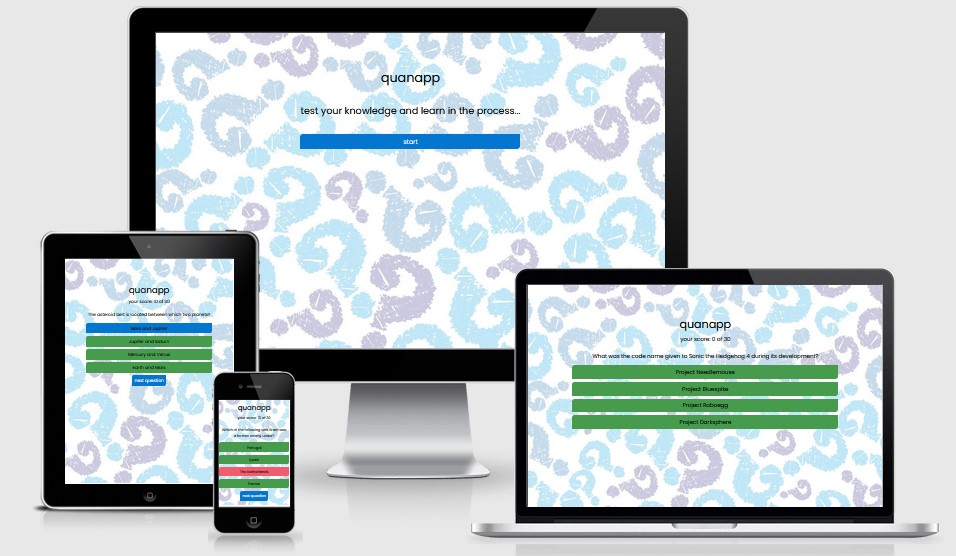

# table of contents

* [ux](#ux "ux")
    * [user goals](#user-goals "user goals")
    * [user stories](#user-stories "user stories")
    * [user requirements and expectations](#user-requirements-and-expectations "user requirements and expectations")
         * [requirements](#requirements "requirements")
         * [expectations](#expectations "expectations")
     * [design choices](#design-choices "design choices")
        * [fonts](#fonts "fonts")
        * [icons](#icons "icons")
        * [colors](#colors "colors")        
        * [structure](#structure "structure")
    * [wireframes](#wireframes "wireframes")
    * [features](#features "features")
        * [existing features](#existing-features "existing features")
            * [main game](#main-game "main game")           
        * [future developments](#future-developments "future developments")
    * [technologies used](#technologies-used "technologies used")
        * [languages](#languages "languages")
        * [libraries and frameworks](#libraries-and-frameworks "libraries and frameworks")
        * [tools](#tools "tools")
    * [testing](#testing "testing")
        * [images](#images "images")
        * [during testing](#during-testing "during teting") 
        * [unfixed bugs](#unfixed-bugs "unfixed bugs")        
    * [deployment](#deployment "deployment")
    * [cloning repository](#cloning-repository "cloning repository")
    * [credits](#credits "credits")
    
# ux

## user goals
* intuitive and responsive to user's interaction
* easily navigated around
* responsive design 

## user stories
* as a user, I want to know how the game works (help)
* as a user, I want to start a game by clicking 'start' button
* as a user, I want to see how many questions there are
* as a user, I want to see if selected answer was correct or not
* as a user, I want to track number of correct answers, see the score
* as a user, I want to see the final score upon quiz completion
* as a user, I want to be able to restart quiz after completion of current game

## user requirements and expectations

### requirements
* fetch data from [opentdb.com](https://opentdb.com/) via API
* randomise questions on reload
* visually neat and tidy design
* responsive design to accommodate modern screen sizes

### expectations
* I expect game to function without errors
* I expect questions to not repeat over and over
* I expect answers will be shffled for qustions that might repeat
* I expect all links to work
* I expect all external links to open in new tabs
* I expect fast website load without loss of image quality
* I expect website will work on phones, tablets and laptops

\
&nbsp;
[back to top](#table-of-contents)
\
&nbsp;

## design choices

### fonts
I used [Google Fonts](https://fonts.google.com/ "Google Fonts"). The font used for the entire website is [Poppins](https://fonts.google.com/specimen/Roboto+Slab?query=rob "Poppins"). 

The use of **small caps** for headings, navbars and other components on the website is **intentional** and is part of the design. This also applies to readme.md file.

### icons
I used [Font Awesome library](https://fontawesome.com/ "Font Awesome") for extra visual cues.

### colors

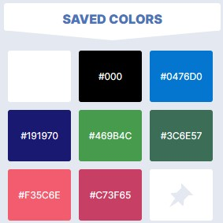
 
 * black: #000; - main font color
 * white: #fff; - all buttons font color
 * game start button colors:
   * blue: #0476D0; - 
   * blue-dark: #191970;
 * answer options button colors:
   * green: #469b4c;
   * green-dark: #3c6e57;
 * game restart button colors:
   * coral: #f35c6e;
   * coral-dark: #c73f65;

### structure
Website is responsive with min-size of iPhone 4 (320px - wide)
The screen size breakpoints are from [Bootstrap breakpoints](https://getbootstrap.com/docs/5.0/layout/breakpoints/ "Bootstrap").

| Screen Size | Breakpoint |
| ----------- | ---------- |
| x-small     | <576px     |
| small       | => 576px   |
| medium      | => 768px   |
| large       | => 992px   |
| x-large     | => 1200px  |

\
&nbsp;
[back to top](#table-of-contents)
\
&nbsp;

# wireframes
I use [diagrams.net](https://www.diagrams.net/ "diagrams.net") to develop wireframes for the website. 
wireframes are designed for mobile device iPhone 4 and scaled upwards. I used [Mozilla Firefox](https://www.mozilla.org/en-US/firefox/browsers/mobile/ "Mozilla Firefox") and [Chrome](https://www.google.com/intl/en_ie/chrome/ "Chrome") developer tools to scale up and adjust design for larger screens.

The wireframe of pages below:

* game screen wireframes

\
&nbsp;

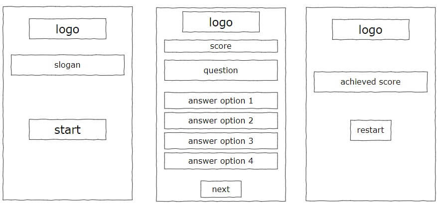

\
&nbsp;
[back to top](#table-of-contents)
\
&nbsp;

# features

## existing features

### main game

Responsive design built with mobile-first approach which adapts to various screen sizes.

* homepage
    - presents game logo, slogan and start game button
    - start button presents user with random multiple choice question fetched from [opentdb.com](https://www.opentdb.com)
    - each correct question increse score by 10 points
    - when user selects the answer the 'next question' button reveals to advance to the next challenge
    - user is presented with total score screen when the last question is answered 

    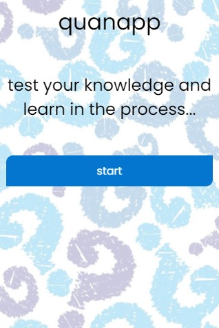
\
&nbsp;

[back to top](#table-of-contents)
\
&nbsp;

## future developments

* allow user to choose number of questions 
* allow user to choose question category
* allow user to choose question difficulty
* allow user to choose type of question - multiple choice or yes/no
* allow user to save score to 'hall of fame' table
* allow user to email achieved score

\
&nbsp;
[back to top](#table-of-contents)
\
&nbsp;

# technologies used

## languages
* [HTML](https://en.wikipedia.org/wiki/HTML "HTML")
* [CSS](https://en.wikipedia.org/wiki/CSS "CSS")
* [javascript](https://www.javascript.com/ "JavaScript")

## libraries and frameworks
* [Google Fonts](https://fonts.google.com/ "Google Fonts")
* [Font Awesome library](https://fontawesome.com/ "Font Awesome")

## tools
* [Gitpod](https://www.gitpod.io/ "Gitpod")
* [Github](https://www.github.com/ "Github")
* [diagrams.net](https://diagrams.net/ "diagrams.net")
* [W3C HTML Validation Service](https://validator.w3.org/ "W3C HTML")
* [W3C CSS Validation Service](https://jigsaw.w3.org/css-validator/ "W3C CSS")
* [JSHint JavaSCript Validation Service](https://jshint.com/ "JSHint JavaScript Validator")
* [autoprefixer](https://autoprefixer.github.io/ "autoprefixer")
* [lighthouse](https://developers.google.com/web/tools/lighthouse "lighthouse")
* [vecteezy](https://www.vecteezy.com/ "vecteezy")
* [WebFX](https://www.webfx.com/web-design/color-picker/F1F1F1/ "WebFX color scheme generator")
* [TinyPNG](https://tinypng.com/ "TinyPNG")
* [Photoshop](https://www.adobe.com/ie/products/photoshop.html "Adobe Photoshop")

\
&nbsp;
[back to top](#table-of-contents)
\
&nbsp;

# testing

I feel that I achieved minimum viable (MVP) product that I set from the very beginning. The quiz app is responsive. It is tidy and simple in its design. There is no noise to discrat the user. Each screen was designed with minimalist approach.

Questions repeat very rarely. Answers of repeated questions are shuffled every time quesiton loads.

The biggest challenge in this projcet was the time constraint. With the limited time between study and work my focus was to build MVP that will meet the criteria required by ['code institute'](https://codeinstitute.net/ie/). At the same time it was great challenge to work towards a short deadline and sticking to MVP plan. 

Second biggest challenge was to fetch questions via API from [opentdb](https://opentdb.com/) and manipulate them to achieve desired results through JavaScript code. I used a lot of 'console.log()' function to test for desired results.

The app is working as expected.

## images
All images on the webiste were compressed using [TinyPNG](https://tinypng.com/ "tinypng.com for image compression")

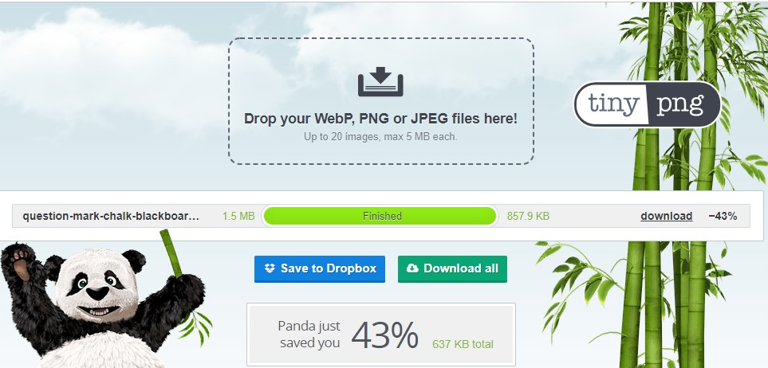

## during testing
* I corrected code 'on the fly' while building the app
* I used ['Unicorn Revealer'](https://chrome.google.com/webstore/detail/unicorn-revealer/lmlkphhdlngaicolpmaakfmhplagoaln) while styling the app
* A

* I tested my applicatoin with [W3C Markup Validation Service](https://validator.w3.org/ "Markup validation sevrvice").

Markup Validation

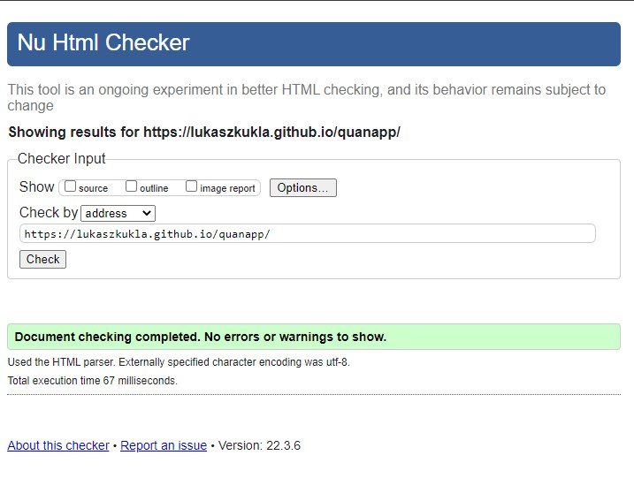

* Subsequently validated my css styles using [W3C CSS Validation Service](https://jigsaw.w3.org/css-validator/ "W3C CSS Validation Service").

CSS Validation

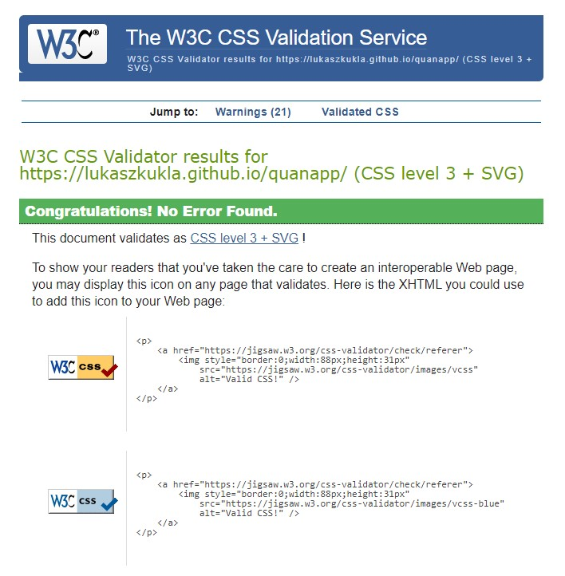

JavaScript Validatoin

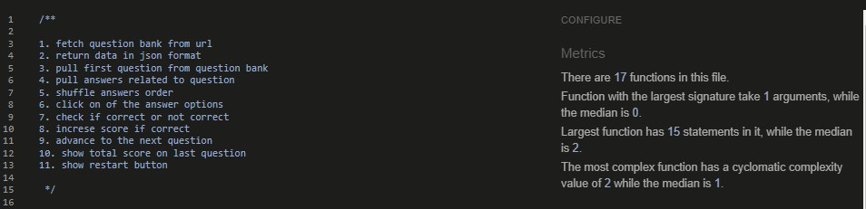

 * Accessibility test was done via [experte.com](https://www.experte.com/accessibility "accessibility testing").

 Accessibility Validation

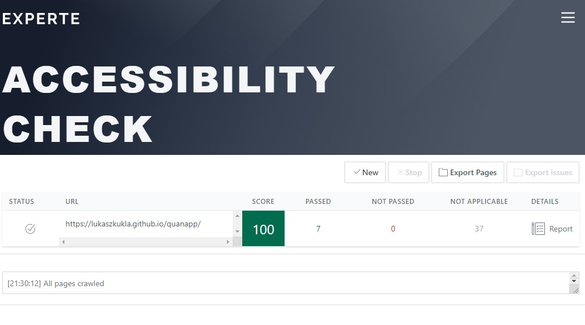.

* Final testing was performed by Google's [Lighthouse](https://developers.google.com/web/tools/lighthouse "lighthouse")

mobile test

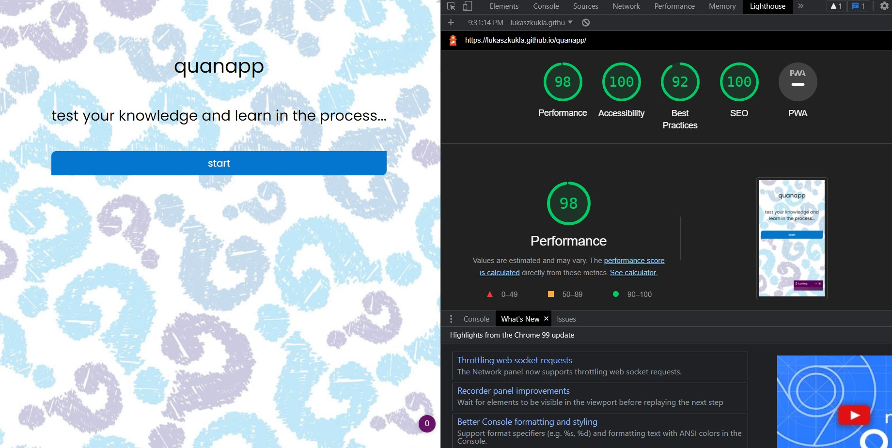

\
&nbsp;

desktop test

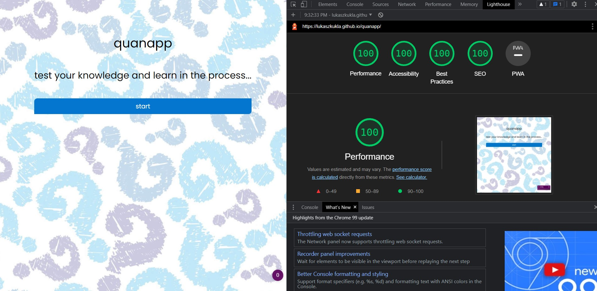

\
&nbsp;

* Website was also tested on physical mobile devices:
    * Galaxy Tab A
    * Google Pixel 4XL
    * Iphone XR
    * iPad 6th generation 2018

\
&nbsp;

* Last but not least I tested website and its responsiveness on 5 browsers:
    * [chrome](https://www.google.com/intl/en_ie/chrome/ "googel chrome browser") - used most of the time throughout the project alnog with the developer tools
    * [firefox](https://www.mozilla.org/en-US/firefox/new/?redirect_source=firefox-com "mozilla firefox browser")
    * [opera](https://www.opera.com/ "opera.com browser")
    * [vivaldi](https://vivaldi.com/ "vivalid borwser")
    * [edge](https://www.microsoft.com/en-us/edge "microsoft edge browser")

\
&nbsp;
[back to top](#table-of-contents)
\
&nbsp;

## unfixed bugs
* I would like to update game with additional feature mentioned in [future developments](#future-developments) section.

\
&nbsp;
[back to top](#table-of-contents)
\
&nbsp;

# deployment
The project was deployed on GitHub pages after initial commits using following process:

* Navigate to the repository on github and click 'Settings'
* Then select 'Pages' on the side navigation
* Select the 'None' dropdown, and then click 'master'
* Click on the 'Save' button.
* Now the website is now live on https://lukaszkukla.github.io/quanapp/
* If any changes are required, they can be done, committed and pushed to GitHub and the changes will be updated

# cloning repository
The project can be copied or cloned using following steps

* log into Github and locate the [repository](https://github.com/lukaszkukla/quanapp "quanapp repository")
* under the repository name click 'code' button
* menu with options to clone or download will unfold
    * download
        * click on download option at the bottom of the menu to save ZIP compressed file to your local hard drive
    * clone using Github and Gitpod UI 
        * click clipboard icon to copy the url
        * paste link into your browser
        * click green Gitpod button
    * clone using CLI
        * click on the GitHub CLI option
        * click on clipboard icon to copy command
        * open Gitbash
        * choose location you want to clone the repository to
        * paste and run copied command

\
&nbsp;
[back to top](#table-of-contents)
\
&nbsp;

# credits

* [Simen Daehlin](https://github.com/Eventyret "Simen Daehlin") - for code inspiration, help and advice

* [Sam Timmins](https://github.com/sam-timmins/T4Tri-triathlon-club "Sam Timmins") - for readme template, structure and some ideas that sparked from using it

* peer community on [code institute](codeinstitute.com) slack channel

* kasia_ci from [code institute](codeinstitute.com) - for keeping up the spirit and leading weekly standups

* [jeff](https://stackoverflow.com/users/353278/jeff) - for the moder version of Fisher-Yates shuffle algorithm
\
&nbsp;
[back to top](#table-of-contents)
\
&nbsp;